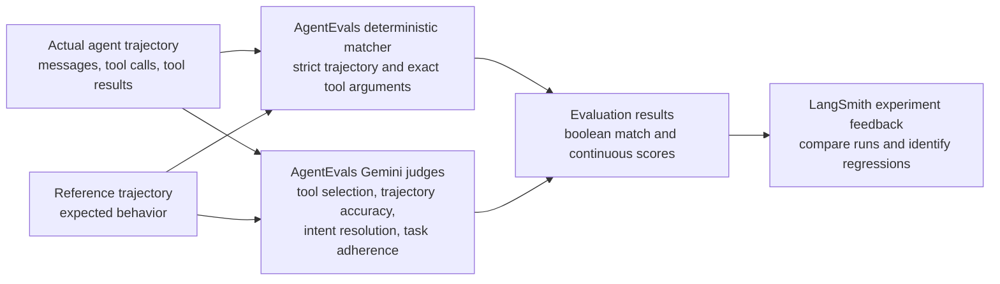

# Eval with LangChain and LangSmith

This lab translates the Azure workshop's evaluation examples into LangChain and LangSmith equivalents powered by Gemini.

You will:

1. Compare generated and reference text with traditional NLP metrics.
2. Score GenAI correctness, relevance, groundedness, helpfulness, retrieval quality, and conciseness.
3. Evaluate safety and security categories with OpenEvals and Gemini.
4. Build deterministic and LLM-based custom evaluators.
5. Evaluate tool calls, intent resolution, and task adherence for agent runs.
6. Run a LangChain application over a LangSmith dataset as a batch experiment.

## Setup

```bash
cd 05_LLM_EVALUATION_AND_OBSERVABILITY/Eval
python3 -m venv .venv
source .venv/bin/activate
pip install -r requirements.txt
cp .env.example .env
```

Add your Google Gemini and LangSmith API keys to `.env`.

## Run the focused examples

```bash
python 01_nlp_scores.py
python 02_genai_quality.py
python 03_safety_scores.py
python 04_custom_evaluators.py
python 05_agentic_evals.py
```

Only `01_nlp_scores.py` runs without API calls. The other focused examples use Gemini as a structured evaluator and send their model traces to LangSmith.

| Example | Evaluation approach | Scores |
|---|---|---|
| `01_nlp_scores.py` | Deterministic text comparison | BLEU, GLEU, METEOR-style, token F1, ROUGE-1, ROUGE-2, ROUGE-L |
| `02_genai_quality.py` | OpenEvals built-in quality prompts with Gemini | Correctness, answer relevance, groundedness, helpfulness, retrieval relevance, conciseness |
| `03_safety_scores.py` | OpenEvals built-in and custom safety prompts with Gemini | Violence, sexual content, self-harm, toxicity, fairness, protected material, prompt injection |
| `04_custom_evaluators.py` | Rules and Gemini judge | Formatting, blocklist compliance, friendliness |
| `05_agentic_evals.py` | AgentEvals trajectory match and LLM judges with Gemini | Strict trajectory match, tool selection, trajectory accuracy, intent resolution, task adherence |

The traditional metrics are compact educational implementations so the lab remains dependency-light. The METEOR-style score uses exact token matching rather than the stemming, synonym, and paraphrase resources used by a full METEOR implementation.

OpenEvals supplies reusable evaluation factories and official quality, safety, and security prompts. AgentEvals supplies deterministic and LLM-based trajectory evaluators. Both are maintained in the LangChain ecosystem and integrate with LangSmith.

The safety evaluator is still an instructional LLM-as-judge example. It is not a replacement for a dedicated production content-safety service or human review.

## Official evaluator references

### GenAI quality prompts

- [`CORRECTNESS_PROMPT`](https://github.com/langchain-ai/openevals/blob/main/python/openevals/prompts/quality/correctness.py)
- [`ANSWER_RELEVANCE_PROMPT`](https://github.com/langchain-ai/openevals/blob/main/python/openevals/prompts/quality/answer_relevance.py)
- [`CONCISENESS_PROMPT`](https://github.com/langchain-ai/openevals/blob/main/python/openevals/prompts/quality/conciseness.py)
- [`RAG_GROUNDEDNESS_PROMPT`](https://github.com/langchain-ai/openevals/blob/main/python/openevals/prompts/rag/groundedness.py)
- [`RAG_HELPFULNESS_PROMPT`](https://github.com/langchain-ai/openevals/blob/main/python/openevals/prompts/rag/helpfulness.py)
- [`RAG_RETRIEVAL_RELEVANCE_PROMPT`](https://github.com/langchain-ai/openevals/blob/main/python/openevals/prompts/rag/retrieval_relevance.py)

### Safety and security prompts

- [`TOXICITY_PROMPT`](https://github.com/langchain-ai/openevals/blob/main/python/openevals/prompts/safety/toxicity.py)
- [`FAIRNESS_PROMPT`](https://github.com/langchain-ai/openevals/blob/main/python/openevals/prompts/safety/fairness.py)
- [`PROMPT_INJECTION_PROMPT`](https://github.com/langchain-ai/openevals/blob/main/python/openevals/prompts/security/prompt_injection.py)

The violence, sexual-content, self-harm, and protected-material rubrics are defined locally in `03_safety_scores.py` because OpenEvals does not export dedicated prompts for those categories.

### Agent evaluation

- [`TOOL_SELECTION_PROMPT`](https://github.com/langchain-ai/openevals/blob/main/python/openevals/prompts/trajectory/tool_selection.py)
- [AgentEvals trajectory evaluation guide](https://docs.langchain.com/langsmith/trajectory-evals)
- [Complete OpenEvals prompt library](https://github.com/langchain-ai/openevals/tree/main/python/openevals/prompts)
- [OpenEvals LangSmith guide](https://docs.langchain.com/langsmith/openevals)

#### How the agentic evaluation works



`05_agentic_evals.py` first represents each execution as LangChain `HumanMessage`, `AIMessage`, and `ToolMessage` objects. The deterministic matcher compares the actual tool sequence and arguments with the reference. The Gemini judges then assess semantic qualities that exact matching cannot capture. The returned feedback can be attached to LangSmith experiment runs.

[Open the editable Excalidraw source](./agentic-evals-flow.excalidraw) in [Microsoft Excalidraw](https://aka.ms/excalidraw).

## Run the LangSmith batch experiment

```bash
python create_dataset.py
python run_evaluation.py
```

`create_dataset.py` is idempotent. It will reuse the existing dataset rather than adding duplicate examples.

The terminal prints a LangSmith experiment URL. Open it to compare the target output, reference answer, evaluator scores, latency, and traces for every example.

## Evaluation methods

| Evaluator | Type | What it checks |
|---|---|---|
| `exact_match` | Deterministic | Whether the normalized response exactly matches the reference answer |
| `token_f1` | Deterministic | Precision and recall of response tokens against the reference answer |
| `relevance` | LLM-as-judge | Whether the response directly and correctly answers the question |

The batch experiment applies exact match, token F1, and Gemini relevance scoring to every dataset example. The focused files make each additional evaluation category easier to study before combining more evaluators into a larger experiment.
