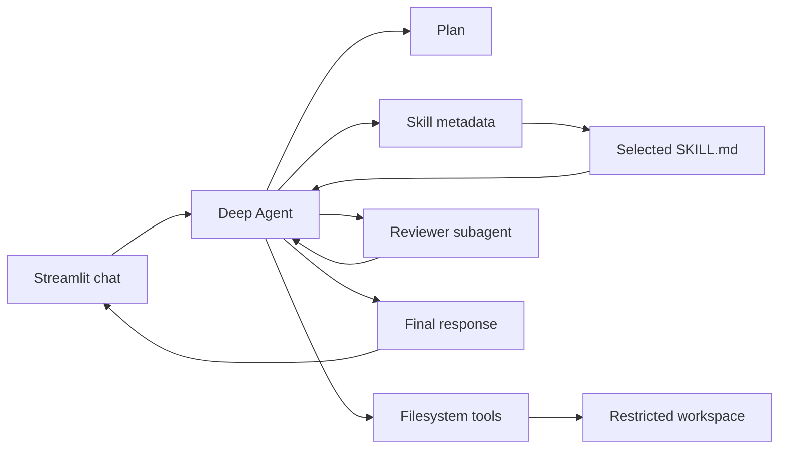

# Exercise 06: Build a Coding Agent Harness

In this exercise you will rebuild the smallest useful version of a coding-agent
interface. The agent can plan work, inspect files, edit files, and ask a
specialized reviewer subagent for feedback. It also discovers reusable skills
and lets learners select them with slash commands.

The exercise uses:

- **Streamlit** for the chat interface
- **LangChain Deep Agents** for the agent harness
- **LangGraph** underneath the harness for agent execution
- **Gemini** as the tool-calling language model
- **FilesystemBackend** for file tools restricted to `workspace/`
- **Agent Skills** for progressively loaded testing and refactoring workflows

## What is an agent harness?

An LLM alone only generates messages. An agent harness adds the reusable
machinery around it:

1. A system prompt that defines the job and rules.
2. Tools that let the model act on the world.
3. A loop that lets the model plan, call tools, inspect results, and continue.
4. State that carries the conversation between steps.
5. Subagents that handle specialized work in a separate context.
6. Skills that load reusable instructions only when a task needs them.

`create_deep_agent` supplies that machinery. This lab focuses on configuring the
harness rather than implementing an agent loop from scratch.

## Project structure

```text
06_AGENT_HARNESS/
├── .env.example
├── agent.py
├── app.py
├── commands.py
├── message_utils.py
├── requirements.txt
├── tests/
│   ├── test_commands.py
│   └── test_message_utils.py
└── workspace/
    ├── README.md
    ├── calculator.py
    └── skills/
        ├── python-refactor/
        │   └── SKILL.md
        └── python-testing/
            ├── SKILL.md
            └── references/
                └── test-checklist.md
```

`agent.py` defines the harness. `app.py` is only the user interface. Keeping
those responsibilities separate makes it easier to replace Streamlit later.

## 1. Set up the exercise

From the repository root:

```bash
cd 06_AGENT_HARNESS
python3 -m venv .venv
source .venv/bin/activate
pip install -r requirements.txt
cp .env.example .env
```

Add your Gemini API key to `.env`:

```dotenv
GOOGLE_API_KEY=your-real-key
GEMINI_MODEL=gemini-2.5-flash
```

Do not commit `.env`.

## 2. Run the interface

```bash
streamlit run app.py
```

Open the local URL printed by Streamlit. Start with:

> Explain the calculator and add a multiply function. Ask the reviewer to check
> the change.

Watch the `workspace/calculator.py` preview in the sidebar. Refreshing after an
agent turn shows the updated file.

## 3. Inspect the agent activity

Every model-backed response includes an expandable **Agent activity** panel.
It updates while the run is in progress and remains available in chat history.

The panel shows observable execution data:

- skills discovered at startup
- main-agent and subagent steps
- tool names and arguments
- file reads and other tool results
- model responses and reported reasoning-token counts

It does not expose private hidden chain-of-thought. Instead, it shows the
actions, plans, tool evidence, and results needed to understand and debug the
agent's behavior. Very large tool results are truncated in the interface.

The app uses LangGraph v2 update streaming:

```python
for part in agent.stream(
    {"messages": messages},
    stream_mode="updates",
    subgraphs=True,
    version="v2",
):
    ...
```

`subgraphs=True` includes reviewer-subagent events. The event namespace tells
the UI whether an update came from the main agent or a delegated subagent.

## 4. Try the skills with slash commands

The prompt composer updates on every keystroke. Type `/` and a command palette
appears, similar to Claude Code:

1. Type `/` to see every installed skill.
2. Continue typing, such as `/python-t`, to filter the list.
3. Click `/python-testing` to insert it into the same prompt composer.
4. Add the task after the command and select **Send**.

You can also enter the complete command directly:

```text
/python-testing add unittest coverage for calculator.py
```

Use `/skills` or the **Show all skills** button to print the available skills
in the conversation without calling the model:

```text
/skills
```

```text
/python-refactor improve calculator.py without changing its public functions
```

Deep Agents itself discovers skills from `SKILL.md` metadata and loads the full
instructions only when relevant. The slash syntax is a small convention in
`commands.py`. It rewrites the learner's request into an explicit instruction
to load one named skill.

This makes skill activation easy to observe during a lesson while still using
the real Deep Agents skills middleware.

Run the slash-router tests with:

```bash
python -m unittest discover -s tests
```

## 5. Follow the request flow



The important configuration is in `agent.py`:

```python
create_deep_agent(
    model="google_genai:gemini-2.5-flash",
    system_prompt=SYSTEM_PROMPT,
    subagents=[REVIEWER_SUBAGENT],
    skills=["skills/"],
    backend=FilesystemBackend(
        root_dir=WORKSPACE_ROOT,
        virtual_mode=True,
    ),
)
```

Deep Agents adds planning, filesystem, and delegation tools. The
`FilesystemBackend` maps the agent's virtual root to this exercise's
`workspace/` folder. The skills path is relative to that virtual root.

Each skill follows the Agent Skills layout:

```text
skills/<skill-name>/SKILL.md
```

`SKILL.md` begins with YAML frontmatter:

```yaml
---
name: python-testing
description: Add or improve focused Python unit tests.
---
```

Only the name and description load at startup. The complete instructions and
supporting references load when the agent activates the skill. This is called
progressive disclosure.

## 6. Understand the safety boundary

This learning agent intentionally has no shell backend:

- It can read and edit files only under `workspace/`.
- It cannot run commands.
- It cannot access the rest of the repository through its file tools.
- You remain responsible for reviewing and running generated code.

A production coding agent normally needs a sandbox, approval controls, limits,
logging, and stronger authentication. Those concerns are omitted here so the
basic harness remains visible.

## 7. Add your own skill

1. Create `workspace/skills/python-docstrings/SKILL.md`.
2. Add `name` and `description` YAML frontmatter.
3. Write a short workflow for improving Python docstrings.
4. Restart Streamlit so the cached agent and sidebar rediscover the skill.
5. Run `/python-docstrings improve calculator.py`.

Skill names should use lowercase letters, numbers, and hyphens. Make each
description specific enough that the model knows when to load it.

## 8. Try small experiments

1. Change the system prompt so the agent always writes tests with new code.
2. Change the reviewer instructions to focus only on Python correctness.
3. Add another sample module to `workspace/` and ask the agent to refactor both
   files.
4. Compare a natural-language testing request with the explicit
   `/python-testing` form.
5. Turn on LangSmith tracing and inspect the skill read, main-agent, and
   subagent runs.

## Reset the exercise

To restore the sample, replace `workspace/calculator.py` with:

```python
"""Small calculator module used by the coding-agent exercise."""


def add(left: float, right: float) -> float:
    """Return the sum of two numbers."""
    return left + right


def subtract(left: float, right: float) -> float:
    """Return the difference between two numbers."""
    return left - right
```

The **Reset conversation** button clears chat history. It does not undo file
changes.

## Official references

- [Deep Agents quickstart](https://docs.langchain.com/oss/python/deepagents/quickstart)
- [Deep Agents backends](https://docs.langchain.com/oss/python/deepagents/backends)
- [Deep Agents subagents](https://docs.langchain.com/oss/python/deepagents/subagents)
- [Deep Agents skills](https://docs.langchain.com/oss/python/deepagents/skills)
- [Deep Agents streaming](https://docs.langchain.com/oss/python/deepagents/streaming)
- [Agent Skills specification](https://agentskills.io/specification)
