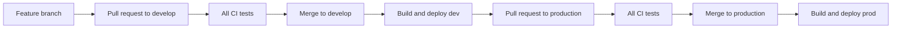

# Exercise 07: Agentic CI/CD for an LLM API

This exercise builds a deliberately small CI/CD pipeline for an LLM-backed
FastAPI service. The goal is to see every important stage without building a
production platform.

You will:

1. Run unit tests.
2. Run functional API tests.
3. Run a live Gemini integration test.
4. Run a live LLM-as-judge evaluation adapted from exercise 05.
5. Build a Docker image.
6. Deploy `develop` to a public Cloud Run development service.
7. Deploy `production` to a separate public Cloud Run production service.

The pipeline is "agentic" because it tests both normal software behavior and
the quality of an LLM-generated answer.

## Architecture



Cloud Run services:

| Git branch | GitHub environment | Cloud Run service |
|---|---|---|
| `develop` | `development` | `mew-cicd-api-dev` |
| `production` | `production` | `mew-cicd-api-prod` |

## Project structure

```text
07_CI_CD/
├── app/
│   ├── main.py
│   ├── models.py
│   └── service.py
├── tests/
│   ├── unit/
│   ├── functional/
│   ├── integration/
│   └── evals/
├── Dockerfile
├── pytest.ini
├── requirements.txt
└── requirements-dev.txt
```

The GitHub Actions workflow lives at
`.github/workflows/07-cicd.yml` because GitHub only discovers workflows in the
repository-level `.github/workflows/` directory.

## 1. Run the API locally

```bash
cd 07_CI_CD
python3 -m venv .venv
source .venv/bin/activate
pip install -r requirements-dev.txt
cp .env.example .env
```

Add a real Gemini key to `.env`, then start the service:

```bash
uvicorn app.main:app --reload --port 8080
```

Test both endpoints:

```bash
curl http://localhost:8080/health

curl -X POST http://localhost:8080/answer \
  -H "Content-Type: application/json" \
  -H "X-API-Key: $APP_API_KEY" \
  -d '{"question":"What is continuous integration?"}'
```

Interactive API documentation is available at
<http://localhost:8080/docs>.

## 2. Learn the four test types

### Unit tests

Unit tests exercise `AnswerService` with a fake model. They are fast,
deterministic, and make no network calls.

```bash
pytest -m unit
```

### Functional tests

Functional tests call the FastAPI endpoints in process. A fake answer service
keeps the API contract test deterministic.

```bash
pytest -m functional
```

### Integration tests

The integration test calls the real Gemini API. It proves that credentials,
the provider SDK, the selected model, and the response contract work together.

```bash
pytest -m integration
```

### LLM evaluation tests

The evaluation test first asks the application a fixed question. Gemini then
acts as a judge using OpenEvals correctness and answer-relevance rubrics. Both
scores must be at least `0.7`.

```bash
pytest -m eval
```

This reuses the LLM-as-judge pattern from
[`05_LLM_EVALUATION_AND_OBSERVABILITY`](../05_LLM_EVALUATION_AND_OBSERVABILITY/).

Run everything with:

```bash
pytest
```

The live tests are intentionally required. A missing `GOOGLE_API_KEY` fails the
pipeline instead of silently skipping coverage. This makes the lesson clear,
but it also means CI consumes a small amount of Gemini quota and can be affected
by provider availability.

## 3. Build and run the container

```bash
docker build -t learning-cicd-api .
docker run --rm -p 8080:8080 \
  -e GOOGLE_API_KEY="$GOOGLE_API_KEY" \
  -e APP_API_KEY="$APP_API_KEY" \
  -e APP_ENV=local-docker \
  learning-cicd-api
```

In another terminal:

```bash
curl http://localhost:8080/health
```

## 4. Prepare Google Cloud once

The commands below use `asia-southeast1`. Change the region in both this setup
and `.github/workflows/07-cicd.yml` if needed.

```bash
export PROJECT_ID="your-gcp-project-id"
export REGION="asia-southeast1"
export REPOSITORY="learning-services"
export DEPLOYER_NAME="github-actions-cicd"
export DEPLOYER_EMAIL="${DEPLOYER_NAME}@${PROJECT_ID}.iam.gserviceaccount.com"

gcloud config set project "$PROJECT_ID"

gcloud services enable \
  run.googleapis.com \
  artifactregistry.googleapis.com \
  secretmanager.googleapis.com

gcloud artifacts repositories create "$REPOSITORY" \
  --repository-format=docker \
  --location="$REGION" \
  --description="Images for the learning CI/CD exercise"
```

Store the runtime Gemini key in Secret Manager:

```bash
printf '%s' "$GOOGLE_API_KEY" | \
  gcloud secrets create gemini-api-key --data-file=-

export APP_API_KEY="$(openssl rand -hex 24)"
printf '%s' "$APP_API_KEY" | \
  gcloud secrets create app-api-key --data-file=-
```

Allow the default Cloud Run runtime identity to read that secret:

```bash
PROJECT_NUMBER="$(gcloud projects describe "$PROJECT_ID" \
  --format='value(projectNumber)')"
RUNTIME_EMAIL="${PROJECT_NUMBER}-compute@developer.gserviceaccount.com"

for SECRET in gemini-api-key app-api-key
do
  gcloud secrets add-iam-policy-binding "$SECRET" \
    --member="serviceAccount:${RUNTIME_EMAIL}" \
    --role="roles/secretmanager.secretAccessor"
done
```

Create the simple deployer identity used by GitHub Actions:

```bash
gcloud iam service-accounts create "$DEPLOYER_NAME" \
  --display-name="GitHub Actions learning deployer"

for ROLE in \
  roles/run.admin \
  roles/artifactregistry.writer \
  roles/iam.serviceAccountUser \
  roles/secretmanager.secretAccessor
do
  gcloud projects add-iam-policy-binding "$PROJECT_ID" \
    --member="serviceAccount:${DEPLOYER_EMAIL}" \
    --role="$ROLE"
done

gcloud iam service-accounts keys create github-actions-key.json \
  --iam-account="$DEPLOYER_EMAIL"
```

This JSON key is chosen because it is easy to understand in a first CI/CD
exercise. Workload Identity Federation is preferred for long-lived production
systems because it avoids service-account key files.

## 5. Configure GitHub environments and secrets

In the repository, create three GitHub environments:

- `ci`
- `development`
- `production`

Add this secret to the `ci` environment:

| Secret | Value |
|---|---|
| `GOOGLE_API_KEY` | Low-quota Gemini key used only by CI tests |

Configure the `ci` environment with a required reviewer. The deterministic
tests run first without secrets. GitHub asks for approval before the live-test
job releases the Gemini key to pull-request code.

Add these secrets to the `development` and `production` environments:

| Secret | Value |
|---|---|
| `GCP_PROJECT_ID` | Google Cloud project ID |
| `GCP_SA_KEY` | Complete contents of `github-actions-key.json` |
| `APP_API_KEY` | Value generated for the `app-api-key` GCP secret |

You can use **Settings > Environments** in GitHub, or the GitHub CLI:

```bash
gh api --method PUT repos/{owner}/{repo}/environments/ci
gh api --method PUT repos/{owner}/{repo}/environments/development
gh api --method PUT repos/{owner}/{repo}/environments/production

gh secret set GOOGLE_API_KEY --env ci

gh secret set GCP_PROJECT_ID --env development --body "$PROJECT_ID"
gh secret set GCP_SA_KEY --env development < github-actions-key.json
gh secret set APP_API_KEY --env development --body "$APP_API_KEY"

gh secret set GCP_PROJECT_ID --env production --body "$PROJECT_ID"
gh secret set GCP_SA_KEY --env production < github-actions-key.json
gh secret set APP_API_KEY --env production --body "$APP_API_KEY"
```

Delete the downloaded key after GitHub contains the secret:

```bash
rm github-actions-key.json
```

Never commit the key or `.env`.

## 6. Create the learning branches

Create `develop` and `production` from the commit that contains this workflow.
Protect both branches if you want merges to require a passing workflow.

The intended flow is:

1. Open a feature pull request into `develop`.
2. CI runs all four test categories and builds the container.
3. Merge into `develop`.
4. CI runs again, then deploys `mew-cicd-api-dev`.
5. Open a pull request from `develop` into `production`.
6. Merge after CI passes.
7. The same pipeline deploys `mew-cicd-api-prod`.

The deploy job prints the public URL and calls `/health`. GitHub marks the job
failed if it cannot reach `/health` or get an authenticated answer from
`/answer`.

The Cloud Run URL is public so learners can call it directly. The LLM endpoint
still requires the `X-API-Key` header to reduce accidental quota abuse:

```bash
curl -X POST "$SERVICE_URL/answer" \
  -H "Content-Type: application/json" \
  -H "X-API-Key: $APP_API_KEY" \
  -d '{"question":"What is Docker?"}'
```

## 7. Inspect the workflow

The workflow has four jobs:

| Job | Runs on pull request | Runs on branch push |
|---|---:|---:|
| `deterministic-tests` | Yes | Yes |
| `live-tests` | Yes, after `ci` approval | Yes, after `ci` approval |
| `container` | Yes | Yes |
| `deploy` | No | Yes |

The workflow is path-scoped to this exercise and its workflow file. Unrelated
lesson changes do not consume live LLM calls or trigger deployment.

## 8. Clean up

Delete the public services and learning resources when finished:

```bash
gcloud run services delete mew-cicd-api-dev \
  --region="$REGION" --quiet

gcloud run services delete mew-cicd-api-prod \
  --region="$REGION" --quiet

gcloud artifacts repositories delete "$REPOSITORY" \
  --location="$REGION" --quiet

gcloud secrets delete gemini-api-key --quiet
gcloud secrets delete app-api-key --quiet

gcloud iam service-accounts delete "$DEPLOYER_EMAIL" --quiet
```

Also remove the GitHub environment secrets if the repository will no longer use
them.
